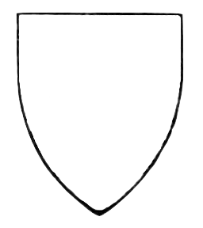

latex input:	mmd-cambridge-header
Title:	A Course of Modern Analysis-Frontmatter
Subtitle:	An introduction to the general theory of
                                 infinite processes and analytic functions;
                                 with an account of the principal
                                 transcendental functions.
Author:	E.T. Whittaker and G.N. Watson
Editor:	Eric Nitardy
Date:	March 6, 2012
Title File:	mmd-WandW-title
Copyright File:	mmd-WandW-copyright
Test:	And this is a new key-value pair
Base Header Level:	1
LaTeX Mode:	memoir  
latex input:	mmd-cambridge-begin-doc 
latex footer:	mmd-cambridge-footer
CSS:	css/front.css
HTML header:	
                                 
                                 

<h1><a href="CMA00-Front.html">A COURSE OF MODERN&nbsp;ANALYSIS</a></h1><h2>E. T. WHITTAKER AND G.&nbsp;N.&nbsp;WATSON</h2>

## A COURSE OF ##
# MODERN ANALYSIS #

#### an introduction to the general theory of infinite&nbsp;processes and analytic&nbsp;functions; ####
#### with an account of the principal  transcendental functions ####

 

###### by ######

### E. T. WHITTAKER, Sc.D., F.R.S. ###
###### PROFESSOR OF MATHEMATICS IN THE UNIVERSITY OF EDINBURGH ######

###### and ######

### G. N. WATSON, Sc.D., F.R.S. ###
###### PROFESSOR OF MATHEMATICS IN THE UNIVERSITY OF BIRMINGHAM ######

 
 

#### Third Edition ####

 
 

##### CAMBRIDGE #####
##### AT THE UNIVERSITY PRESS #####
##### 1920 #####

 

###### transcribed and edited as a website by ######
##### Eric Nitardy #####
##### 2012 #####

 
 

---------------------------	

  

#### CAMBRIDGE UNIVERSITY PRESS ####

#### C. F. CLAY, Manager ####

#### LONDON: FETTER LANE, E.C. 4 ####

| 	| 	|
| :--------------------	| ------------------------------------------------:	|
| NEW YORK : 	|                 THE MACMILLAN CO. 	|
| 	| 	|
| 	| 	|
| BOMBAY 	| 	|
| CALCUTTA 	|         MACMILLAN AND CO., Ltd.	|
| MADRAS 	| 	|
| 	| 	|
| 	| 	|
| TORONTO : 	|           THE MACMILLAN CO. OF 	|
| 	|           CANADA, Ltd. 	|
| 	| 	|
| TOKYO : 	| MARUZEN-KABUSHIKI-KAISHA	|

##### ALL RIGHTS RESERVED #####

*First Edition* 1902 

*Second Edition* 1915

*Third Edition* 1920

 

------------------------

## Preface ##

Advantage has been taken of the preparation of the third edition of this work to add a chapter on Ellipsoidal Harmonics and Lame's Equation, and to rearrange the chapter on Trigonometrical Series so that the parts which are used in Applied Mathematics come at the beginning of the chapter. A number of minor errors have been corrected and we have endeavoured to make the references more complete.

Our thanks are due to Miss Wrinch for reading the greater part of the proofs and to the staff of the University Press for much courtesy and consideration during the progress of the printing.

| 	| 
| :-------	  |
|\\(\quad\\) | 
| E.T.W.	  |
| G.N.W.	  | 

July, 1920.

## Editor's Note ##

After twenty-five years of failed predictions, the paperless office finally seems to have arrived. The near print quality resolution of the 'New iPad' and its competitors will likely further reduce the use of paper. Most mathematicians and physicists have been distributing their work electronically for a long time using files produced by TeX based typesetting software.[^mn:1,-24] This software, as excellent as it is, was designed around print, which, I have noted, is quickly vanishing. It might be time to think seriously about publishing mathematics directly on the web or on its cousin the e-book.[^mn:2,-11]  As an experiment,[^mn:3,+4] I am transcribing for the web Whittaker and Watson's classic work on complex analysis and special functions. Its value as a reference work, extensive use of parenthetical comments, and numerous footnotes and references may combine to make it more pleasant and useful to read on the web than on paper. You may judge for yourself.

[^mn:1,-24]: [TeX](http://en.wikipedia.org/wiki/TeX), a typesetting system that Donald Knuth originally designed to typeset mathematics, now forms the core for the [LaTeX document preparation system](http://www.latex-project.org/) widely used to prepare scientific papers for publication. 

[^mn:2,-11]: There are  software tools for converting LaTeX into `.html` and `.css` files from which one might build a website, notably [LaTeX2HTML](http://latex2html.org/node1.html) and [TeX4ht](http://www.tug.org/tex4ht/), but the quality of the result is poor, and the `.css` files produced are muddled and difficult to customize.

[^mn:3,+4]: I prepare the text for these pages with Fletcher Penny's [MultiMarkdown](http://fletcherpenney.net/multimarkdown/), which can generate either web pages or a LaTeX document from the text. The excellent [MathJax](http://www.mathjax.org/) script renders the mathematics.

I am transcribing the third edition from 1920, which is in the public domain. According to the preface for the fourth and final edition of 1927, very little had changed from the third edition. I have retained the old-fashioned spelling and heavy use of semi-colons, but I have altered the typography and layout to fit the web and improve readability. The footnotes have been reformed as margin notes which are initially hidden, but become visible when tapped. I have, when possible, added links to on-line versions of the mentioned references and, occasionally, added editorial comments, which I have clearly marked.

This effort has just begun: I have only the first two chapters finished as of this writing. Given my other commitments and my determination to do all the *examples*,[^mn:4,-7] I expect to complete a chapter every month, roughly. Thus, I should finish sometime late 2013 or early 2014. Feel free to offer comments or corrections.[^mn:5,+5] I will update this note as things move along.

[^mn:4,-7]: Whittaker and Watson, in the British tradition, refer to problems for the reader as *examples*. Those marked with "Math.Trip." are from the famous Cambridge Tripos exam and can be difficult.

[^mn:5,+5]: Contact me at <a href="&#x6d;&#x61;&#x69;&#108;&#116;&#111;&#58;&#110;&#x69;&#x74;&#104;&#x61;&#114;&#100;&#x74;&#x40;&#x75;&#x77;&#46;&#101;&#x64;&#x75;">&#x6e;&#x69;&#116;&#x68;&#x61;&#114;&#100;&#x74;&#x40;&#117;&#119;&#x2e;&#101;&#x64;&#x75;</a>.

Eric Nitardy

April, 2012.

 

----------------------------

#### Construction Notes ####

+ [Missing References](ConstructionNotes.html#missingreferences)
+ [Unresolved Examples](ConstructionNotes.html#unresolvedexamples)

----------------------------

<h2 id="contents">Contents</h2>

  <ul>
    <li><a href="CMA00-Front.html#acourseof">Title Page</a></li>
    <li><a href="#cambridgeuniversitypress">Copyright</a></li>
    <li><a href="#preface">Preface</a></li>
    <li><a href="#editorsnote">Editor&#8217;s Note</a></li>
  </ul>

  <ol>
<h3><a href="CMA01-Complex.html" style="color: #001160;">PROCESSES OF ANALYSIS</a></h3>

    <li  class="current"><a href="CMA01-Complex.html#complexnumbers">Complex Numbers</a>
      <ol>
        <li>1.1 <a href="CMA01-Complex.html#rationalnumbers">Rational numbers</a></li>
        <li>1.2 <a href="CMA01-Complex.html#dedekind">Dedekind's theory of irrational numbers</a></li>
        <li>1.3 <a href="CMA01-Complex.html#complexnumberssection">Complex numbers</a></li>
        <li>1.4 <a href="CMA01-Complex.html#themodulusofacomplexnumber">The modulus of a complex number</a></li>
        <li>1.5 <a href="CMA01-Complex.html#thearganddiagram">The Argand diagram</a></li>
        <li><a href="CMA01-Complex.html#references">References</a></li>
        <li><a href="CMA01-Complex.html#miscellaneousexamples">Miscellaneous Examples</a></li>
      </ol>
    </li>
    <li><a href="CMA02-1-Limits.html">The Theory of Convergence</a>
      <ol>
          <li>2.1 <a href="CMA02-1-Limits.html#limits">The Definition of the Limit of a Sequence</a></li>
          <li>2.2 <a href="CMA02-1-Limits.html#thelimitofanincreasingsequence">The Limit of an Increasing Sequence</a></li>
	  <li>2.3 <a href="CMA02-2-Series.html#convergenceofaninfiniteseries">Convergence of an Infinite Series</a></li>
	  <li>2.4 <a href="CMA02-3-MoreSeries.html#effectofchangingtheorderoftermsinaseries">Changing the Order of the Terms in a Series</a></li>
	  <li>2.5 <a href="CMA02-3-MoreSeries.html#doubleseries">Double Series</a></li>
	  <li>2.6 <a href="CMA02-3-MoreSeries.html#powerseries">Power Series</a></li>
	  <li>2.7 <a href="CMA02-4-Products.html#infiniteproducts">Infinite Products</a></li>
	  <li>2.8 <a href="CMA02-4-Products.html#infinitedeterminants">Infinite Determinants</a></li>
         <li><a href="CMA02-4-Products.html#references">References</a>
         <li><a href="CMA02-4-Products.html#miscellaneousexamples">Miscellaneous Examples</a></li>
      </ol>
    </li>
    <li><a href="CMA03-1-ContinuousFns.html">Continuous Functions and Uniform&nbsp;Convergence</a>
      <ol>
          <li>3.1 <a href="CMA03-1-ContinuousFns.html#thedependenceofonecomplexnumberonanother">The Dependence of One Complex Number on Another</a></li>
          <li>3.2 <a href="CMA03-1-ContinuousFns.html#continuityoffunctionsofrealvariables">Continuity of Functions of Real Variables</a></li>
	  <li>3.3 <a href="CMA03-2-Uniformity.html#seriesofvariableterms.uniformityofconvergence.">Series of Variable Terms. Uniformity of Convergence.</a></li>
	  <li>3.4 <a href="CMA03-2-Uniformity.html#discussionofaparticulardoubleseries.">A Particular Double Series</a></li>
	  <li>3.5 <a href="CMA03-3-Heine-Borel.html#theconceptofuniformity.">The Concept of Uniformity</a></li>
	  <li>3.6 <a href="CMA03-3-Heine-Borel.html#themodifiedheine-boreltheorem.">The Modified Heine-Borel Theorem</a></li>
	  <li>3.7 <a href="CMA03-3-Heine-Borel.html#uniformconvergenceofpowerseries.">Uniform Convergence of Power Series</a></li>
         <li><a href="CMA03-3-Heine-Borel.html#references">References</a>
         <li><a href="CMA03-3-Heine-Borel.html#miscellaneousexamples">Miscellaneous Examples</a></li>
      </ol>
</li>
    <li class="notdone"><a href="whereOwhere.html">The Theory of Reimann Integration</a></li>
     <li class="notdone"><a href="whereOwhere.html">The Fundamental Properties of Analytic&nbsp;Functions</a></li>
    <li class="notdone"><a href="whereOwhere.html">The Theory of Residues</a></li>
    <li class="notdone"><a href="whereOwhere.html">The Expansion of Functions in Infinite&nbsp;Series</a></li>
    <li class="notdone"><a href="whereOwhere.html">Asymptotic Expansions and Summable&nbsp;Series</a></li>
    <li class="notdone"><a href="whereOwhere.html">Fourier Series and Trigonometrical&nbsp;Series</a></li>
     <li class="notdone"><a href="whereOwhere.html">Linear Differential Equations</a></li>
     <li class="notdone"><a href="whereOwhere.html">Integral Equations</a></li>
 
<h3><a href="#processesofanalysis" style="color: #001160;">THE TRANSCENDENTAL FUNCTIONS</a></h3>

    <li class="notdone"><a href="whereOwhere.html">The Gamma Function</a></li>
    <li class="notdone"><a href="whereOwhere.html">The Zeta Function of Riemann</a></li>
    <li class="notdone"><a href="whereOwhere.html">The Hypergeometric Function</a></li>
    <li class="notdone"><a href="whereOwhere.html">Legendre Functions</a></li>
    <li class="notdone"><a href="whereOwhere.html">The Confluent Hypergeometric Function</a></li>
    <li class="notdone"><a href="whereOwhere.html">Bessel Functions</a></li>
    <li class="notdone"><a href="whereOwhere.html">The Equations of Mathematical Physics</a></li>
    <li class="notdone"><a href="whereOwhere.html">Mathieu Functions</a></li>
    <li class="notdone"><a href="whereOwhere.html">Elliptic Functions. General theorems and the Weierstrassian&nbsp;Functions</a></li>
    <li class="notdone"><a href="whereOwhere.html">The Theta Functions</a></li>
    <li class="notdone"><a href="whereOwhere.html">The Jacobian Elliptic Functions</a></li>
    <li class="notdone"><a href="whereOwhere.html">Ellipsoidal Harmonics and Lamé&#8217;s&nbsp;Equation</a></li> 
  </ol>

  <ul>
    <li class="notdone"><a href="whereOwhere.html">Appendix</a></li>
    <li class="notdone"><a href="whereOwhere.html">Authors Quoted</a></li>
  </ul>
</ul>
 

<h3>Typeset by <a href="../index.html" target="_blank">Eric Nitardy </a> AND Hosted by <a href="https://github.com/" target="_blank"> GitHub.</a></h3>
<h4>All content is either in the public domain or <a href="http://creativecommons.org/licenses/by/3.0/us/" target="_blank">licensed under a Creative Commons Attribution 3.0 United States License.</a></h4>

<h2 id="contents">Contents</h2>
<ul>
<li class="part"><a>FRONTMATTER</a>
  <ul>
    <li  class="current"><a href="#acourseof">Title Page</a></li>
    <li  class="current"><a href="#cambridgeuniversitypress">Copyright</a></li>
    <li  class="current"><a href="#preface">Preface</a></li>
    <li  class="current"><a href="#editorsnote">Editor&#8217;s Note</a></li>
    <li  class="current"><a href="#contents">Table of Contents</a></li>
  </ul>
</li>
<li class="part"><a onClick="hideIt('navfront');showIt('navprocesses');">PROCESSES OF ANALYSIS</a></li>
<li class="part"><a onClick="hideIt('navfront');showIt('navtranscendental');hideIt('navback');">THE TRANSCENDENTAL FUNCTIONS</a></li>
<li class="part"><a onClick="hideIt('navfront');showIt('navback');">BACKMATTER</a></li>
</ul>

<h2 id="contents">Contents</h2>
<ul>
<li class="part"><a onClick="showIt('navfront');hideIt('navprocesses');">FRONTMATTER</a>  
<ul>
    <li class="more current"><a onClick="showIt('navfront');hideIt('navprocesses');"> you are here . . . </a></li>
  </ul></li>
<li class="part"><a>PROCESSES OF ANALYSIS</a>
  <ul >
    <li><a href="CMA01-Complex.html#complexnumbers">Complex Numbers</a></li>
    <li><a href="CMA02-1-Limits.html">The Theory of Convergence</a></li>
     <li><a href="CMA03-1-ContinuousFns.html">Continuity and Uniform Convergence</a></li>
     <li class="notdone"><a href="whereOwhere.html">The Theory of Riemann Integration</a></li>
     <li class="notdone"><a href="whereOwhere.html">The Properties of Analytic Functions</a></li>
     <li class="notdone"><a href="whereOwhere.html">The Theory of Residues</a></li>
     <li class="notdone"><a href="whereOwhere.html">Expanding Functions in Infinite Series</a></li>
     <li class="notdone"><a href="whereOwhere.html">Asymptotic Expansions and Summability</a></li>
     <li class="notdone"><a href="whereOwhere.html">Fourier Series &amp; Trigonometrical Series</a></li>
     <li class="notdone"><a href="whereOwhere.html">Linear Differential Equations</a></li>
     <li class="notdone"><a href="whereOwhere.html">Integral Equations</a></li>
  </ul>
</li>
<li class="part"><a onClick="hideIt('navprocesses');showIt('navtranscendental');">THE TRANSCENDENTAL FUNCTIONS</a></li>
<li class="part"><a onClick="hideIt('navprocesses');showIt('navback');">BACKMATTER</a></li>
</ul>

<h2 id="contents">Contents</h2>
<ul>
<li class="part"><a onClick="showIt('navfront');hideIt('navtranscendental');">FRONTMATTER</a>  
<ul>
    <li class="more current"><a onClick="showIt('navfront');hideIt('navtranscendental');hideIt('navback');"> you are here . . . </a></li>
  </ul></li>
<li class="part"><a onClick="showIt('navprocesses');hideIt('navtranscendental');">PROCESSES OF ANALYSIS</a></li>
<li class="part"><a>THE TRANSCENDENTAL FUNCTIONS</a>
  <ul>
    <li class="notdone"><a href="whereOwhere.html">The Gamma Function</a></li>
    <li class="notdone"><a href="whereOwhere.html">The Zeta Function</a></li>
    <li class="notdone"><a href="whereOwhere.html">The Hypergeometric Function</a></li>
    <li class="notdone"><a href="whereOwhere.html">Legendre Functions</a></li>
    <li class="notdone"><a href="whereOwhere.html">The Confluent Hypergeometric Function</a></li>
    <li class="notdone"><a href="whereOwhere.html">Bessel Functions</a></li>
    <li class="notdone"><a href="whereOwhere.html">The Equations of Mathematical Physics</a></li>
    <li class="notdone"><a href="whereOwhere.html">Mathieu Functions</a></li>
    <li class="notdone"><a href="whereOwhere.html">Elliptic &amp; Weierstrassian Functions</a></li>
    <li class="notdone"><a href="whereOwhere.html">The Theta Functions</a></li>
    <li class="notdone"><a href="whereOwhere.html">The Jacobian Elliptic Functions</a></li>
    <li class="notdone"><a href="whereOwhere.html">Ellipsoidal Harmonics &amp; Lamé&#8217;s Equation</a></li> 
  </ul>
  </li>
<li class="part"><a onClick="hideIt('navtranscendental');showIt('navback');">BACKMATTER</a></li>
</ul>

<h2 id="contents">Contents</h2>
<ul>
<li class="part"><a onClick="showIt('navfront');hideIt('navback');">FRONTMATTER</a>  
<ul>
    <li class="more current"><a onClick="showIt('navfront');hideIt('navback');"> you are here . . . </a></li>
  </ul>
</li>
<li class="part"><a onClick="showIt('navprocesses');hideIt('navback');">PROCESSES OF ANALYSIS</a></li>
<li class="part"><a onClick="showIt('navtranscendental');hideIt('navback');">THE TRANSCENDENTAL FUNCTIONS</a></li>
<li class="part"><a>BACKMATTER</a>
  <ul >
    <li class="notdone"><a href="whereOwhere.html">Appendix</a></li>
    <li class="notdone"><a href="whereOwhere.html">Authors Quoted</a></li>
  </ul>
</li>
</ul>

<a onClick="showIt('navfront');hideIt('navprocesses');hideIt('navtranscendental');hideIt('navback');showIt('navfixedrightlist');hideIt('navfixedrightempty');" style="float: left;">&#x25A4;</a> <a href="CMA01-Complex.html" style="float: right;">&#x25B6;</a>

<a onClick="hideIt('navfront');hideIt('navprocesses');hideIt('navtranscendental');hideIt('navback');hideIt('navfixedrightlist');showIt('navfixedrightempty');" style="float: left;">&#x25A2;</a> <a href="CMA01-Complex.html" style="float: right;" >&#x25B6;</a>

